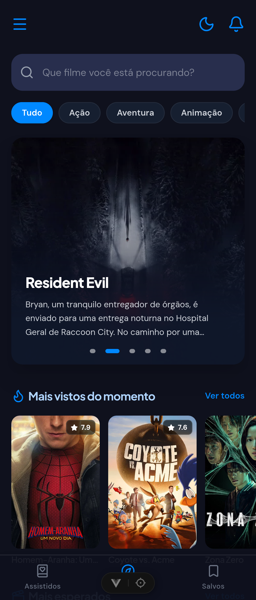
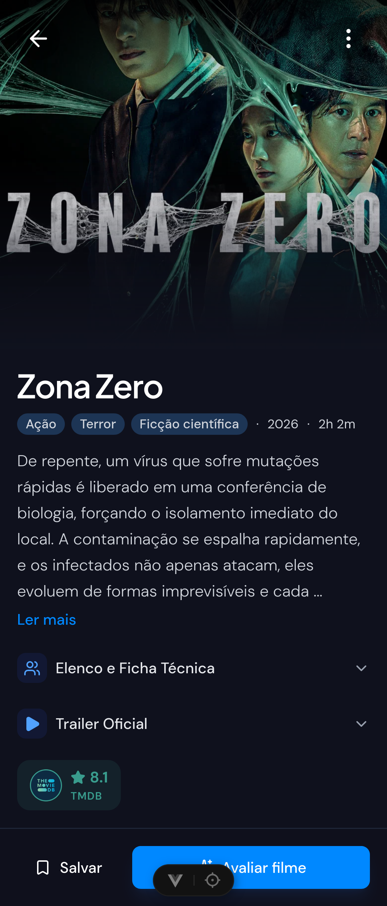
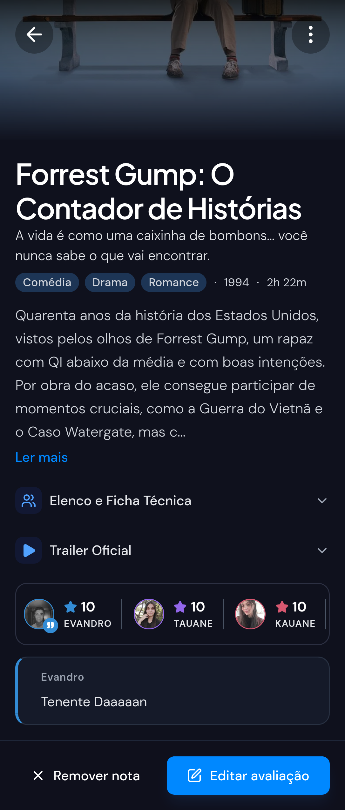
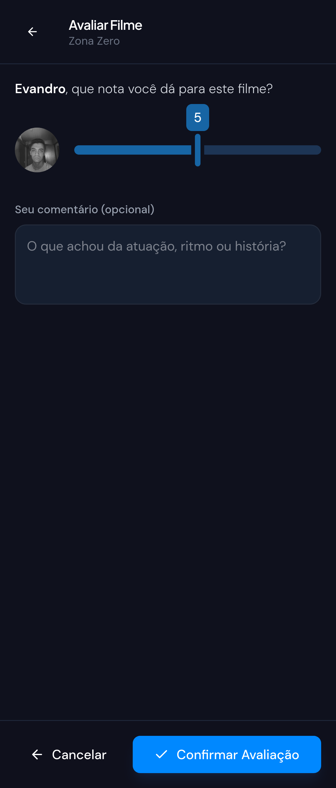
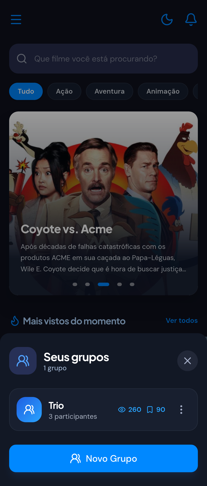
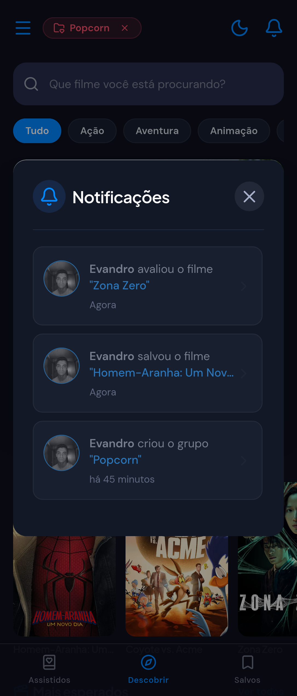

# 🎬 SeenIt — Catálogo & Avaliação de Filmes em Grupo

Aplicaçāo web **Mobile-First** desenvolvida para resolver um problema real: organizar e compartilhar listas de filmes assistidos e avaliações entre amigos e familiares em tempo real.

> 📱 **Nota:** Esta aplicação foi projetada e otimizada exclusivamente para uso mobile. A experiência de navegação em desktop pode ser limitada.

🚀 **Live Demo:** [Acesse a aplicação no Vercel](https://seen-it-kappa.vercel.app)

---

## 📸 Demonstração da Interface

| Tela Inicial / Catálogo | Detalhes do Filme | Avaliações do Filme |
| :---: | :---: | :---: |
|  |  |  |

| Avaliar Filme | Lista de Grupos | Notificações |
| :---: | :---: | :---: |
|  |  |  |

---

## 📖 História & Evolução do Projeto

O projeto nasceu de uma necessidade real: aos finais de semana, eu e minhas primas nos reuníamos para assistir filmes e registrávamos nossas notas em um bloco de notas. Conforme o número de filmes cresceu, a gestão ficou ineficiente e sem apelo visual.

Inicialmente construído em Vanilla JS (HTML/CSS + Firestore), o projeto cresceu em escopo e complexidade. A migração completa para **Vue 3** permitiu reestruturar a aplicação utilizando programação reativa, arquitetura de componentes escalável e gerenciamento de estado otimizado.

---

## 🚀 Funcionalidades Principais

- **Catálogo & Busca em Tempo Real:** Integração com a API do TMDB exibindo lançamentos, populares, mais aguardados e busca personalizada.
- **Grupos & Compartilhamento:** Criação de grupos para compartilhar filmes salvos, notas individuais e média de avaliações do grupo.
- **Filtros Avançados:** Filtragem de filmes por elenco, diretor e faixas de nota.
- **Notificações Integradas:** Sistema de notificações por Push (via OneSignal) e notificações internas em tempo real quando membros adicionam ou avaliam filmes.
- **Autenticação & Perfis:** Gerenciamento de perfil com foto e autenticação segura de usuários.
- **Interface Mobile-First:** UX/UI otimizada para navegação sensível ao toque e telas menores.

---

## 🛠️ Tecnologias & Arquitetura

- **Frontend:** Vue 3 (Composition API, Pinia, Vue Router)
- **Estilização:** Tailwind CSS (Mobile-First / Custom UI Components)
- **APIs & Backend:** 
  - **TMDB API:** Catálogo e metadados de filmes
  - **Firebase Firestore:** Banco NoSQL e sincronização de estado em tempo real
  - **Supabase Storage:** Armazenamento e otimização de imagens de perfil
  - **OneSignal:** Envio e gestão de Notificações Push
- **Ferramentas:** Git, Vite, Compressor.js, Zod
